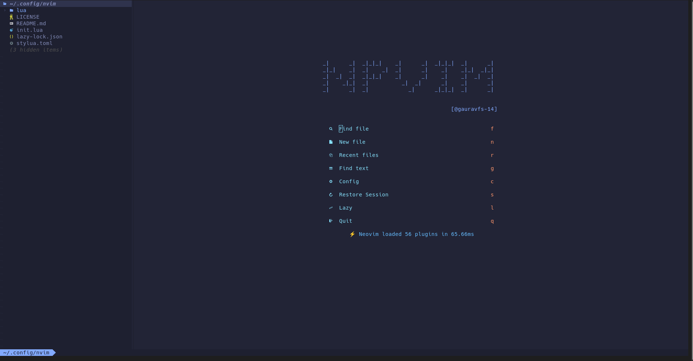

# NpVim

NpVim is a ready-to-use neovim config build on top of lazyvim.



## ✨ Features

- 🔥 Transform your Neovim into a full-fledged IDE
- 💤 Easily customize and extend your config with lazy.nvim
- 🚀 Blazingly fast
- 🧹 Sane default settings for options, autocmds, and keymaps
- 📦 Comes with a wealth of plugins pre-configured and ready to use
- 🤖 Ai Code Completition with Tabnine
- 👨‍💻 Preconfigured with Typescript, TSX, React, Emmet, markdown preview, eslint, prettier, etc.

## 🛠️ Installation

_Linux_

- Backup pervious configs.

  ```
  # required
  mv ~/.config/nvim ~/.config/nvim.bak

  # optional but recommended
  mv ~/.local/share/nvim ~/.local/share/nvim.bak
  mv ~/.local/state/nvim ~/.local/state/nvim.bak
  mv ~/.cache/nvim ~/.cache/nvim.bak
  ```

- Clone the repo
  ```
  git clone https://github.com/gauravfs-14/NpVim ~/.config/nvim
  ```
- Start neovim
  ```
  nvim
  ```

## ⌨️ Keymaps

- Same as [here](https://www.lazyvim.org/keymaps)
- Additional
  - _Mode_: "n",
    _Key_: "Ctrl + y",
    _action_: "accept the suggestion by tabnine"

More on [lazyvim.org](https://www.lazyvim.org/)
